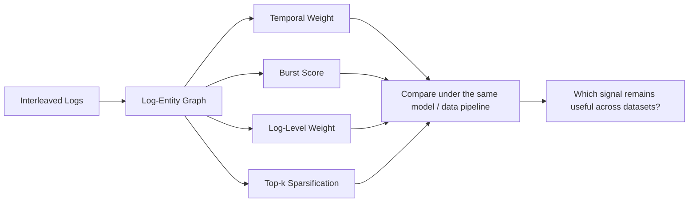

<div align="center">

# Gilsu Park

### ML / AI Engineering · Anomaly Detection · Graph & Temporal Learning · ML Systems

I work with **operational data**—system logs and network flows—and build models and systems that turn those signals into actionable anomaly detections.

My background in Java/Spring web systems led into an M.S. in Data Science, where I studied how **temporal and structural information in logs** can improve anomaly detection under interleaving.

<br>

[](https://www.riss.kr/link?id=T17372490)
[](https://github.com/prosild/netflow_portscan_detection)
[](https://github.com/prosild/NexusPortal)

</div>

---

## 🔎 Profile

- **Software engineering:** maintained operational Java/Spring web systems and traced issues across application logic, SQL, data, and application logs.
- **Data science:** completed an **M.S. in Data Science at Kookmin University** with a focus on log anomaly detection.
- **Research:** studied interleaved logs using **Log-Entity Graphs**, with particular attention to temporal proximity, burst behavior, log severity, and graph sparsification.
- **Current direction:** anomaly detection for logs and network data, temporal/dynamic graphs, AIOps, security analytics, and ML systems that connect models to real operational pipelines.

---

## 🎓 M.S. Thesis

### [Comparative Analysis of Adjacency Construction Strategies for Log-Entity Graph-Based Anomaly Detection under Interleaving](https://www.riss.kr/link?id=T17372490)

**인터리빙 환경에서 로그-엔티티 그래프 인접 구조 설계의 비교 분석**  
M.S. Thesis · Department of Data Science · Kookmin University  
[`RISS`](https://www.riss.kr/link?id=T17372490)

Interleaving occurs when logs from multiple concurrent tasks are mixed along the same timeline.  
This makes simple sequence or transition-based modeling vulnerable to unrelated events being treated as if they belonged to the same execution flow.

The thesis keeps the core **Log-Entity Graph** framework and asks a narrower question:

> **How should log-to-log adjacency be designed so that the graph reflects operational context, not only shared entities?**



### Adjacency strategies

| Strategy | Idea |
| --- | --- |
| **Temporal weight** | Strengthen relationships between logs that occur close in time and weaken distant relationships |
| **Burst score** | Emphasize locally dense log activity that may indicate state changes or failures |
| **Log-level weight** | Reflect the different severity of INFO, WARN, ERROR, FATAL, etc. |
| **Top-k sparsification** | Remove weaker edges from dense subgraphs and preserve stronger relationships |

### Key result

The **temporal-weighted adjacency** was the only design that improved F1 over the baseline on all three evaluated datasets.

| Dataset | Baseline F1 | Temporal-weighted F1 |
| --- | ---: | ---: |
| BGL | 0.9268 | **0.9307** |
| Thunderbird | 0.9580 | **0.9602** |
| HDFS | 0.8174 | **0.8282** |

Other signals were more dataset-dependent: burst weighting produced the highest result on Thunderbird, while Top-k sparsification performed best on HDFS.

**Takeaway:** temporal proximity was the most consistent signal across the evaluated interleaved-log environments, while the usefulness of other adjacency signals depended more strongly on dataset characteristics.

---

## 🛠️ Selected Engineering Work

### 1. [NetFlow Port Scan Detection](https://github.com/prosild/netflow_portscan_detection)

A security anomaly-detection project that connects **packet collection → flow aggregation → window generation → rule / deep-learning inference → PostgreSQL → dashboard**.

<p align="center">
  
</p>

#### Detection pipeline

- Captures network packets on a **Synology NAS**
- Aggregates packets into **5-tuple flows**
- Uses a memory queue and batch writer to separate collection from persistence
- Sends flows to a **FastAPI** inference service
- Builds source-based windows of up to **32 flows / 30 seconds**
- Evaluates each window with both:
  - interpretable port-scan rules
  - a lightweight **FlowTransformer**
- Stores scores, rule evidence, and final decisions in **PostgreSQL**
- Surfaces detections through a web dashboard

```text
Packet
  ↓
5-tuple Flow
  ↓
30s / max 32 Flow Window
  ↓
Rule Detector + FlowTransformer
  ↓
Alert / Review / Normal
  ↓
PostgreSQL
  ↓
Dashboard
```

### Evaluation

On the CIDDS-002 Week2 evaluation used in the project:

| Method | Precision | Recall | F1 |
| --- | ---: | ---: | ---: |
| Rule Detector | 79.16% | 50.08% | 61.35% |
| FlowTransformer | 87.86% | 89.47% | 88.66% |
| Rule OR Deep Learning | 78.02% | 90.67% | 83.87% |
| **Deep Learning + explicit scan rules** | **87.93%** | **90.24%** | **89.07%** |

The project uses rules for patterns with clear signatures and the learned model to complement them on patterns that are harder to express with fixed thresholds.

<p align="center">
  
</p>

**Links:**  
[`Repository`](https://github.com/prosild/netflow_portscan_detection) ·
[`Dashboard`](https://psdev93.synology.me/portfolio/portscan)

---

### 2. [NexusPortal](https://github.com/prosild/NexusPortal)

A modernization of a legacy Spring MVC portal into a **Java 17 / Spring Boot 3.5** application, extended to consume and visualize the port-scan detection results.

**Engineering work**

- migrated XML-based Spring MVC configuration to **Spring Boot**
- migrated database logic to **PostgreSQL**
- added **Spring Security**, Argon2id, CSRF protection, login-attempt limiting, and upload-path validation
- connected detection results through PostgreSQL and application APIs
- added administrator and read-only portfolio views for detection windows
- packaged deployment with **Docker Compose**
- maintained automated tests with **JUnit 5 / MockMvc**

This project is where my earlier web-system background and the anomaly-detection pipeline meet: the model output becomes data that an operational application can store, query, inspect, and present.

[`Repository`](https://github.com/prosild/NexusPortal)

---

## 🧰 Tech Stack

<p>
  
  
  
  
  
  
  
  
  
</p>

| Area | Tools / Technologies |
| --- | --- |
| **ML / Data** | PyTorch, scikit-learn, pandas, NumPy |
| **Backend** | Java, Spring Boot, Spring Security, MyBatis, FastAPI |
| **Database** | PostgreSQL, SQL |
| **Web** | HTML, CSS, JavaScript, JSP, jQuery, Bootstrap |
| **Ops / Workflow** | Docker, Linux, Git, Conda |

---

## 🎯 Current Focus

<table>
<tr>
<td width="33%" valign="top">

### Anomaly Detection
- Log anomaly detection
- Security / network anomaly detection
- Distribution shift
- Robust detection

</td>
<td width="33%" valign="top">

### Graph & Temporal ML
- Log-Entity Graphs
- Dynamic / temporal graphs
- Temporal behavior
- Structural anomaly signals

</td>
<td width="33%" valign="top">

### ML Systems
- AIOps
- ML engineering
- MLOps
- Model serving / monitoring
- LLM / RAG for log & security analysis

</td>
</tr>
</table>

---

## 🧭 Engineering Perspective

I am most interested in systems where the model is part of a larger operational path:

```text
Operational Data
      ↓
Collection / Parsing
      ↓
Representation
      ↓
Detection / Inference
      ↓
Evaluation
      ↓
API / Storage
      ↓
Monitoring / Application
```

My goal is to keep working on the boundary between **anomaly-detection research and the systems required to use those models in practice**.
