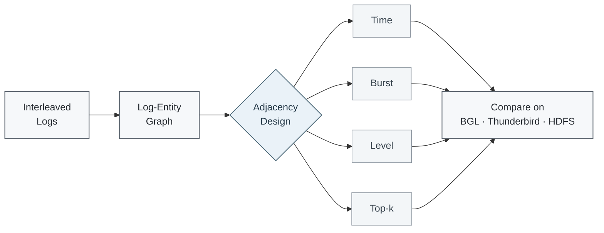
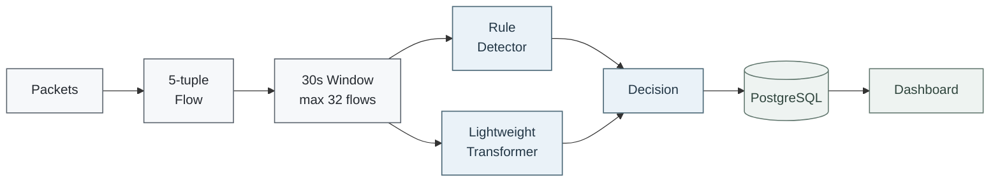

<div align="center">

# Gilsu Park

### AI / ML Engineering · Anomaly Detection · ML Systems

I work with **operational data such as system logs and network flows**, focusing on how abnormal behavior can be detected, evaluated, and connected to real systems.

My background in Java/Spring web systems led into an M.S. in Data Science, where I studied **log anomaly detection under interleaving** and the role of temporal and structural signals in graph-based models.

<br>


</div>

---

## 👋 About

I started in **Java / Spring-based web systems**, working with application logic, databases, and logs in operational environments.

That experience led me to data science and eventually to **anomaly detection**: instead of only finding where a failure occurred, I became interested in which patterns in operational data can explain abnormal behavior and whether those patterns remain useful when the environment changes.

I completed an **M.S. in Data Science at Kookmin University** and now focus on problems around **log anomaly detection, graph learning, time-series behavior, security analytics, AIOps, and ML systems**.

---

## 🔬 Research

### Interleaved Log Anomaly Detection

In large systems, logs from many concurrent tasks can be mixed together on the same timeline.  
This **interleaving problem** makes it difficult to determine which events actually belong to the same execution context.

My thesis studied the adjacency structure of a **Log-Entity Graph**, where log events and entities are modeled together.  
The main question was:

> **What information should determine how strongly two log events are connected?**



I compared four adjacency strategies while keeping the rest of the model and data pipeline fixed.

| Signal | Idea |
| --- | --- |
| **Temporal proximity** | Strengthen relationships between logs that occur close in time |
| **Burst behavior** | Emphasize locally dense log activity |
| **Log severity** | Reflect the different importance of INFO, WARN, ERROR, and FATAL |
| **Top-k sparsification** | Remove weaker edges from dense log subgraphs |

### Result

Across the three evaluated datasets, **temporal-weighted adjacency showed consistent F1 improvements over the baseline**.

| Dataset | Baseline F1 | Temporal Weight F1 |
| --- | ---: | ---: |
| BGL | 0.9268 | **0.9307** |
| Thunderbird | 0.9580 | **0.9602** |
| HDFS | 0.8174 | **0.8282** |

These results suggest that **temporal proximity can provide a stable and useful signal for interleaved log anomaly detection**.

**Master's Thesis**  
*인터리빙 환경에서 로그-엔티티 그래프 인접 구조 설계의 비교 분석*  
Kookmin University · Department of Data Science · 2026

[](https://www.riss.kr/link?id=T17372490)

---

## 🛠️ Project

### NetFlow Port Scan Detection

A network anomaly-detection pipeline that combines explicit scan rules with a **lightweight Transformer model for flow-window classification**.

The Transformer component is a simplified implementation inspired by FlowTransformer-style sequence modeling rather than a direct reproduction of the original architecture.



### What I implemented

- packet collection and **5-tuple flow aggregation**
- memory queue + batch writer for separating collection from DB writes
- source-based detection windows of up to **32 flows within 30 seconds**
- rule-based detection for explicit scan patterns
- lightweight Transformer encoder for learned flow-sequence patterns
- **FastAPI** inference interface
- **PostgreSQL** storage for flows, model scores, rule evidence, and decisions
- dashboard integration for reviewing detection windows

The project uses **Scapy** for packet collection and controlled test traffic, but keeps packet handling separate from the ML inference pipeline.

### Evaluation

On the CIDDS-002 Week2 evaluation used in the project:

| Method | Precision | Recall | F1 |
| --- | ---: | ---: | ---: |
| Rule Detector | 79.16% | 50.08% | 61.35% |
| Lightweight Transformer | 87.86% | 89.47% | 88.66% |
| **Transformer + explicit scan rules** | **87.93%** | **90.24%** | **89.07%** |

The rules handle patterns with clear signatures, while the learned model complements them on flow patterns that are harder to describe with a fixed threshold.

[](https://github.com/prosild/netflow_portscan_detection)

---

## 🧰 Tech Stack

<p>
  
  
  
  
  
  
  
  
  
</p>

| Area | Technologies |
| --- | --- |
| **ML / Data** | Python, PyTorch, scikit-learn, pandas, NumPy |
| **Backend / API** | Java, Spring, MyBatis, FastAPI |
| **Database** | PostgreSQL |
| **Web** | JavaScript, HTML/CSS, JSP, jQuery, Bootstrap |
| **Engineering** | Docker, Linux, Git, Conda |

---

## 🎯 Interests

<table>
<tr>
<td width="50%" valign="top">

### Modeling

- Log anomaly detection
- Network / security anomaly detection
- Graph learning
- Time-series modeling
- Distribution shift
- Robust anomaly detection

</td>
<td width="50%" valign="top">

### Systems

- AIOps
- ML systems
- MLOps
- Model serving and evaluation
- Monitoring pipelines
- LLM-assisted log / security analysis

</td>
</tr>
</table>

---

## 🚀 What I Want to Work On

I want to work on **AI systems that detect abnormal behavior in complex operational environments**.

In particular, I am interested in three connected areas:

### 1. Understanding operational data

Logs, metrics, and network traffic contain temporal and structural patterns that are easily lost when they are reduced to simple feature vectors or fixed sequences.

I want to study representations that preserve the information needed to distinguish **normal change from meaningful anomalies**.

### 2. Building models that survive changing environments

Real systems change over time: workloads shift, software is updated, new events appear, and normal behavior itself evolves.

I am interested in anomaly-detection models that remain useful under **distribution shift and changing system behavior**, rather than only performing well on a fixed offline benchmark.

### 3. Turning models into usable systems

Detection is only useful when the result can reach the people and systems that need it.

I want to work across the path from:

```text
Operational Data
      ↓
Data Pipeline
      ↓
ML Model
      ↓
Inference / Evaluation
      ↓
API & Storage
      ↓
Monitoring / Investigation
```

This is why I am interested in both **AIOps** and **MLOps**: AIOps defines the operational problems I want to solve, while ML engineering and MLOps provide the practices needed to build, deploy, and maintain those solutions.
