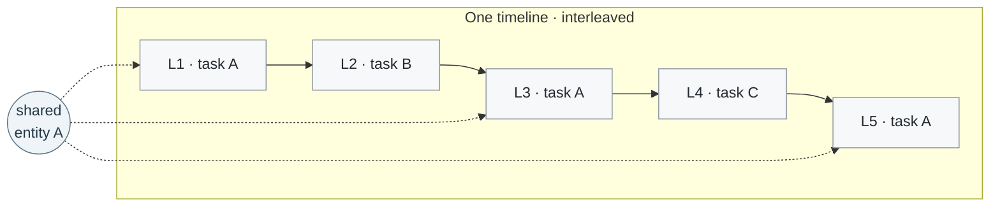
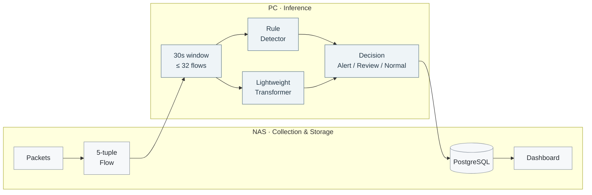

# Gilsu Park

**ML / MLOps Engineer · Security & Log Anomaly Detection**

I build ML systems that detect abnormal behavior in operational data — system logs and network flows — and connect the models to real collection, serving, and storage pipelines.

---

## At a Glance

- **3+ years in operations** — maintained a public-sector Java/Spring (eGovFrame) system; traced incidents across screens, server logic, SQL, data, and WAS logs
- **M.S. in Data Science, Kookmin University** — graph-based log anomaly detection under *interleaving*
- **End-to-end detection system** — NetFlow port-scan detector from packet collection on a NAS to PyTorch/FastAPI inference and a review dashboard (**F1 89.07%** on CIDDS-002 Week2)

---

## Now

**SKT K-New Deal Academy · ALEPH** (security operations track, until Dec 2026)

Building a security ML pipeline on top of the course, step by step:

- [ ] PCAP → Zeek JSON logs, reproducible with Docker
- [ ] Data validation and label alignment (pandas)
- [ ] PySpark preprocessing and time-window aggregation → Parquet
- [ ] Unsupervised baseline with experiment tracking (scikit-learn, MLflow)
- [ ] Inference API and storage (FastAPI, PostgreSQL, Docker Compose) with CI
- [ ] Dynamic graph anomaly detection as the main model

---

## Research · Interleaved Log Anomaly Detection

When many tasks run at once, their logs are mixed on one timeline. Sequence models then see transitions that never actually happened.

A **Log-Entity Graph** reconnects related logs through the entities they share (IDs, addresses, components). My thesis asked:

> **What information should decide how strongly two logs are connected?**

I redesigned the log adjacency matrix in four ways and compared them under a controlled setup — same data loader, splits, model, and training, with only the adjacency changed.

| Design | Idea |
| --- | --- |
| Temporal weight | Logs closer in time are connected more strongly |
| Burst score | Emphasize logs in locally dense bursts |
| Log level | Weight by severity (DEBUG → FATAL) |
| Top-k | Keep only the strongest edges per log |

**F1-score** (single run per setting; best per dataset in bold)

| Dataset | Baseline | Temporal | Burst | Level | Top-k |
| --- | ---: | ---: | ---: | ---: | ---: |
| BGL | 0.9268 | **0.9307** | 0.9263 | 0.9230 | 0.9094 |
| Thunderbird | 0.9580 | 0.9602 | **0.9769** | 0.9630 | 0.9588 |
| HDFS | 0.8174 | 0.8282 | 0.8178 | 0.8172 | **0.8342** |

- **Temporal weighting was the only design that beat the baseline on all three datasets** in this setup.
- The other designs helped on some datasets and hurt on others, so the right adjacency depends on the data's characteristics.
- Next: repeated runs with mean ± std, and combining signals.

*인터리빙 환경에서 로그-엔티티 그래프 인접 구조 설계의 비교 분석* · Kookmin University · 2026

---

## Project · NetFlow Port Scan Detection

Explicit scan rules plus a lightweight Transformer that classifies 30-second flow windows.  
Collection and storage run always-on on a NAS; training and inference run on a GPU PC.

<!-- Add one dashboard screenshot or GIF here, e.g.  -->

**What I built:** Scapy packet collection and 5-tuple flow aggregation · queue + batch writer to decouple capture from DB writes · per-source windows · rule detector · Transformer encoder (PyTorch) · FastAPI inference · PostgreSQL storage for flows, scores, and rule evidence · Spring Boot dashboard

**Design decisions**

- **Leakage-free evaluation** — normalization fitted on Week1 train only; Week1 for train/validation, Week2 for test
- **Window as the decision unit** — flows grouped per source IP into 30-second windows of up to 32 flows, so the model sees scan *behavior*, not single flows
- **Rules and model have separate roles** — rules catch clear signatures fast; the model covers slow or varied scans that fixed thresholds miss
- **Simplified model** — inspired by FlowTransformer-style sequence modeling, not a reproduction of the original

**Evaluation · CIDDS-002 Week2**

| Method | Precision | Recall | F1 |
| --- | ---: | ---: | ---: |
| Rule detector | 79.16% | 50.08% | 61.35% |
| Lightweight Transformer | 87.86% | 89.47% | 88.66% |
| **Transformer + explicit scan rules** | **87.93%** | **90.24%** | **89.07%** |

**Limitations:** CIDDS-002 is a simulated dataset, and evaluation on live traffic (false-positive rate, latency) is the next step.

---

## Tech Stack

| Area | Technologies |
| --- | --- |
| **ML / Data** | Python, PyTorch, scikit-learn, pandas, NumPy |
| **Serving / Data store** | FastAPI, PostgreSQL |
| **Infra / Tools** | Docker, Docker Compose, Linux, Git, Conda, CUDA |
| **Backend** | Java, Spring Boot, MyBatis, SQL |

---

## Interests

Log and network anomaly detection · graph learning on operational data · robustness under distribution shift · reproducible ML pipelines, serving, and monitoring for security operations
